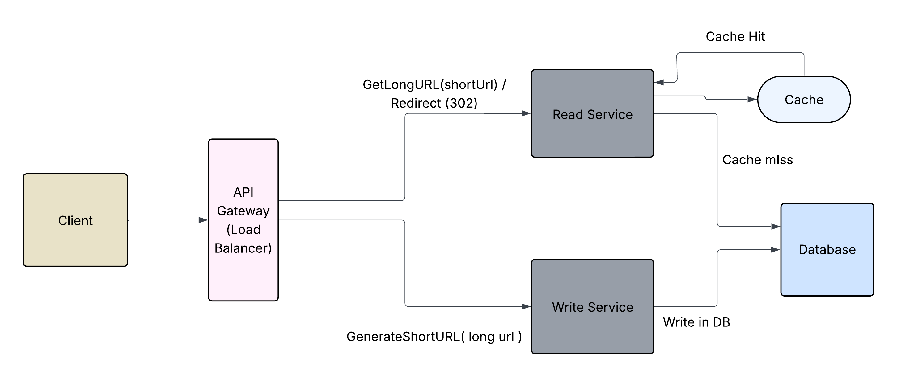

# 🚀 Distributed URL Shortener

A scalable, high-performance URL Shortener built using **Golang, PostgreSQL, Redis, and React**.



This project demonstrates distributed system design principles including:
- Unique ID generation
- Caching strategies
- Read-heavy optimization
- Horizontal scalability
- CAP theorem considerations

---

# 📌 Problem Statement

Design and implement a distributed URL shortener that:

- Generates short URLs from long URLs
- Redirects users with low latency
- Ensures uniqueness
- Handles high read traffic
- Scales horizontally

---

# 🏗 High-Level Architecture
                ┌──────────────────────┐
                │       Client         │
                │  (Browser / User)    │
                └─────────┬────────────┘
                          │
                          ▼
                ┌──────────────────────┐
                │   React Frontend     │
                │   (Optional UI)      │
                └─────────┬────────────┘
                          │
                          ▼
                ┌──────────────────────┐
                │     Go API Server    │
                │  (REST Endpoints)    │
                └─────────┬────────────┘
                          │
          ┌───────────────┴───────────────┐
          ▼                               ▼
 ┌─────────────────┐             ┌─────────────────┐
 │      Redis      │             │   PostgreSQL     │
 │  (Cache + ID)   │             │  (Persistent DB) │
 └─────────────────┘             └─────────────────┘


 
---

# ⚙️ Architecture Explanation

## 1️⃣ Client Layer
- Users access the system via browser.
- React frontend (optional) provides UI for creating and managing links.

## 2️⃣ API Layer (Golang)
Handles:
- URL creation
- Redirection
- Business logic
- Validation

Why Go?
- Lightweight
- High concurrency (goroutines)
- Low latency
- Excellent for read-heavy systems

## 3️⃣ Redis Layer
Used for:
- Caching short → long URL mappings
- Atomic counter (`INCR`) for ID generation

Why Redis?
- Extremely fast (in-memory)
- Atomic operations
- Reduces database load

## 4️⃣ PostgreSQL Layer
Stores:
- Short URL
- Long URL
- Metadata
- Expiration time

Indexed on `short_url` for fast lookup.

---

# 🧠 System Design Decisions

## 🔹 ID Generation Strategy

We use:
Redis INCR → Base62 Encoding → Short URL

Example:

INCR global:url:id → 10001
Base62(10001) → "bM9"


Advantages:
- No collisions
- No hash truncation issues
- Simple and scalable
- Atomic operations ensure uniqueness

---

## 4️⃣ PostgreSQL Layer

Stores:

- short_url (Primary Key)
- long_url
- user_id
- created_at
- expires_at

### Schema

```sql
CREATE TABLE urls (
    id BIGSERIAL PRIMARY KEY,
    short_url VARCHAR(10) UNIQUE NOT NULL,
    long_url TEXT NOT NULL,
    user_id BIGINT,
    created_at TIMESTAMP DEFAULT CURRENT_TIMESTAMP,
    expires_at TIMESTAMP
);

CREATE INDEX idx_short_url ON urls(short_url);